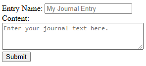

This is a super simple journaling application where all journal entries are logged to a sqlite database for later lookup and use. Everything runs locally, and no javascript is required on the frontend.

To run, install deno and run
`deno run --allow-read --allow-write --allow-net main.ts`